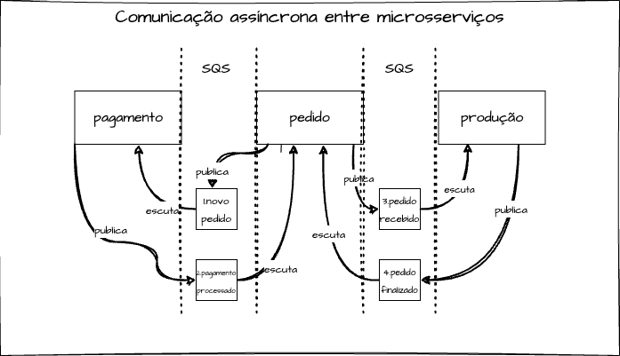
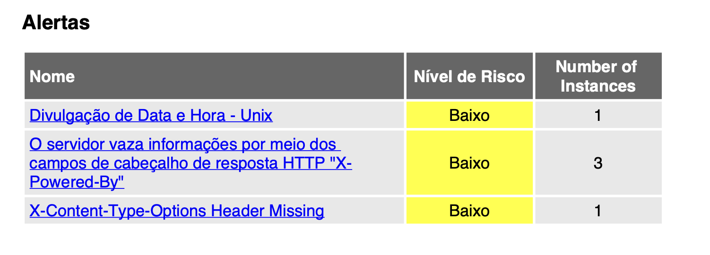
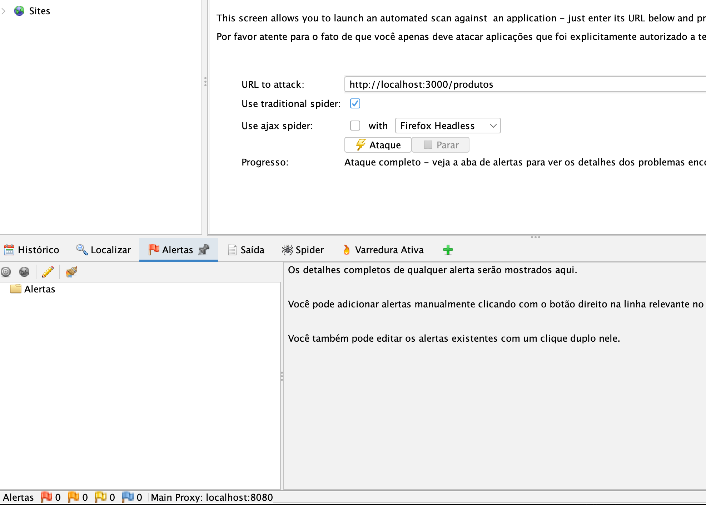

<h1 align="center">
    Hexafood Pedidos
</h1>


## Índice

- <a href="#boat-sobre-o-projeto">Sobre o projeto</a>
- <a href="#hammer-tecnologias">Tecnologias</a>
- <a href="#rocket-como-rodar-esse-projeto">Como rodar esse projeto</a>
- <a href="#open_file_folder-sobre-o-microsserviço-pedido">Sobre o Microsserviço Pedido</a>
- <a href="#electric_plug-cobertura-de-testes-com-sonarcloud">Cobertura de testes com SonarCloud</a>
- <a href="#bookmark_tabs-licença">Licença</a>
- <a href="#wink-autores">Autores</a>
## :boat: Sobre o projeto

Esse projeto faz parte do trabalho "Tech Challenge - Fase 05", ministrado no quinto módulo do curso de Pós Graduação Software Architecture da FIAP em parceria com a Alura.

Para exercitar os conceitos apresentados nas matérias do curso, sendo elas SAGA Pattern, Desenvolvimento Seguro e Privacidade de Dados e Lei Geral de Proteção de Dados (LGPD), esse projeto foi atualizado a fim de abarcar os novos conteúdos. Dessa forma, cada microsservico do projeto foi alterado para implementar novas práticas aprendidas no módulo. Nesse repositório está o microsserviço de Pedidos. 

Toda infraestrutura e microsserviços estão distribuídos pelos seguintes repositórios:

- [Hexaform (Infraestrutura)](https://github.com/lucassouzati/hexaform)
- [Microsserviço Pedido](https://github.com/lucassouzati/hexafood-pedido) (Este)
- [Microsserviço Produção](https://github.com/brpadilha/hexafood-producao)
- [Microsserviço Pagamento](https://github.com/stesuzart/hexafood-payments)


## :hammer: Tecnologias:

- **[Typescript](https://www.typescriptlang.org)**
- **[NestJS](https://nestjs.com/)**
- **[PostgreSQL](https://www.postgresql.org/)**
- **[JestJS](https://jestjs.io/pt-BR/)**

## :rocket: Como rodar esse projeto

Se você estiver usando Windows, vai precisar do WSL para rodar esse projeto de forma prática. Para isso, você pode instalá-lo seguindo o seguinte [tutorial](https://learn.microsoft.com/pt-br/windows/wsl/install). Também será necessário uma distribuição linux para utilizar o WSL. Recomendo o Ubuntu que pode ser baixando na própria Microsoft Store no [link](https://apps.microsoft.com/store/detail/ubuntu/9PDXGNCFSCZV).
Depois, vai precisar do Docker, o qual a versão de Windows pode ser encontrada [aqui](https://docs.docker.com/desktop/install/windows-install/).
Então, clone o projeto dentro do WSL, vá para pasta dele e execute o comando:

```
docker compose build --no-cache
```

Após a construção da imagem, basta executar o comando:

```
docker compose up
```

O projeto estará executando no endereço http://localhost:3000/.

Para limpar o volume db do docker, execute o comando:
docker-compose down -v

## :open_file_folder: Sobre o Microsserviço Pedido

Após quebrar a arquitetura monolítica anterior, o fluxo da criação de pedidos foi mantido nesse microsserviço. Isso indica que ele é o principal responsável por todo fluxo, tendo o papel de criar o pedido e comunicar ao cliente que o mesmo está pronto. Ao removermos as responsabilidade de pagamento e gestão de produção para outros microsserviços, isolamos o fluxo de ponta a ponta. O pedido começa nesse microsserviço, é atualizado durante as fases e depois concluído também.  

A comunicação com os outros microsserviços, se dá através de uma fila SQS da AWS. Quando o pedido é criado, este microsserviço deve disparar uma mensagem na fila informando que existe um novo pedido. Ao mesmo tempo, este microsserviço fica escutando a fila de pagamentos processados, que é o resultado do procesamento de novos pedidos pelo microsserviço pagamento. 

Este microsserviço então atualiza o status do pedido com base nas informações obtidas na fila de pagamentos processados, e dispara uma outra mensagme para fila de pedidos recebidos. Esssa por sua vez é monitorada pelo microsserviço de produção, a qual é responsável por disparar outra mensagem informando que o pedido está pronto.

Por fim, o microsserviço de pedido ecuta a fila de pedidos prontos e atualiza o status para que o cliente retire o mesmo. Esse fluxo, pode ser visto na imagem a seguir:

<br>
<h4 align="center">
    
</h4>
<br>


## :world: Desenvolvimento Seguro com OWASP Zap

A fim de atender aos critérios de Desenvolvimento Seguro, foi aplicado o Dynamic Application Security Testing (DAST) nesse microsserviço, a fim de detectar vulnerabilidades nas APIs servidas pelos microsserviços. Para isso, foi utlizado a ferramenta apresentada no módulo, chamada OWASP Zap. 

Os testes DAST são executados no conceito de teste da caixa preta, ou seja, de forma externa a aplicação e sem acesso ao código fonte. Com OWASP Zap, ele pode ser realizado tanto numa página web como em endpoints de uma API, sendo a forma adequada para os testes de segurança nos microsserviços.

Ao executar o escaneamento pela primeira vez no endpoint do cardápio "produtos", foram relatadas as seguintes vulnerabilidades:

<br>
<h4 align="center">
    
</h4>
<br>

Todas vulnerabilidades eram de baixa criticidade e tinham relação com informações expostas no header das responses da API. Foi implementado um middleware na API deste microsserviço, a fim de sanar todas vulnerabilidades encontradas. Após a implementação, a ferramenta não encontrou mais vulerabilidades, conforme imagem a seguir:


<br>
<h4 align="center">
    
</h4>
<br>

O relatório completo gerado pelo OWASP Zap pode ser encontrado no link abaixo:

[Relatório Completo OWASP Zap](.github/readme/2024-03-08-ZAP-Report-.pdf)


## :bookmark_tabs: Licença

Este projeto esta sobe a licença MIT. Veja a [LICENÇA](https://opensource.org/licenses/MIT) para saber mais.

## :wink: Autores

Feito com ❤️ por:

- [Bruno Padilha](https://www.linkedin.com/in/brpadilha/)
- [Lucas Siqueira](https://www.linkedin.com/in/lucassouzatidev/)
- [Marayza](https://www.linkedin.com/in/marayza-gonzaga-7766251b1/)

[Voltar ao topo](#índice)