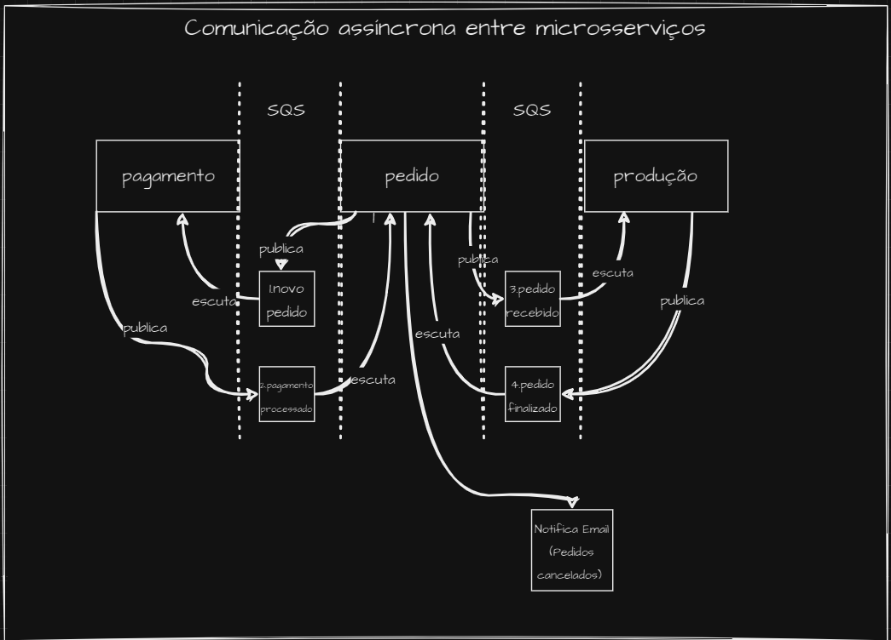

a<h1 align="center">
    Hexafood Pedidos
</h1>


## Índice

- <a href="#boat-sobre-o-projeto">Sobre o projeto</a>
- <a href="#hammer-tecnologias">Tecnologias</a>
- <a href="#rocket-como-rodar-esse-projeto">Como rodar esse projeto</a>
- <a href="#open_file_folder-sobre-o-microsserviço-pedido">Sobre o Microsserviço Pedido</a>
- <a href="#electric_plug-cobertura-de-testes-com-sonarcloud">Cobertura de testes com SonarCloud</a>
- <a href="#lgpd"> LGDP</a>
- <a href="#bookmark_tabs-licença">Licença</a>
- <a href="#wink-autores">Autores</a>
## :boat: Sobre o projeto

Esse projeto faz parte do trabalho "Tech Challenge - Fase 05", ministrado no quinto módulo do curso de Pós Graduação Software Architecture da FIAP em parceria com a Alura.

Para exercitar os conceitos apresentados nas matérias do curso, sendo elas SAGA Pattern, Desenvolvimento Seguro e Privacidade de Dados e Lei Geral de Proteção de Dados (LGPD), esse projeto foi atualizado a fim de abarcar os novos conteúdos. Dessa forma, cada microsservico do projeto foi alterado para implementar novas práticas aprendidas no módulo. Nesse repositório está o microsserviço de Pedidos. 

Toda infraestrutura e microsserviços estão distribuídos pelos seguintes repositórios:

- [Hexaform (Infraestrutura)](https://github.com/lucassouzati/hexaform)
- [Microsserviço Pedido](https://github.com/lucassouzati/hexafood-pedido) (Este)
- [Microsserviço Produção](https://github.com/brpadilha/hexafood-producao)
- [Microsserviço Pagamento](https://github.com/stesuzart/hexafood-payments)


## :hammer: Tecnologias:

- **[Typescript](https://www.typescriptlang.org)**
- **[NestJS](https://nestjs.com/)**
- **[PostgreSQL](https://www.postgresql.org/)**
- **[JestJS](https://jestjs.io/pt-BR/)**

## :rocket: Como rodar esse projeto

Se você estiver usando Windows, vai precisar do WSL para rodar esse projeto de forma prática. Para isso, você pode instalá-lo seguindo o seguinte [tutorial](https://learn.microsoft.com/pt-br/windows/wsl/install). Também será necessário uma distribuição linux para utilizar o WSL. Recomendo o Ubuntu que pode ser baixando na própria Microsoft Store no [link](https://apps.microsoft.com/store/detail/ubuntu/9PDXGNCFSCZV).
Depois, vai precisar do Docker, o qual a versão de Windows pode ser encontrada [aqui](https://docs.docker.com/desktop/install/windows-install/).
Então, clone o projeto dentro do WSL, vá para pasta dele e execute o comando:

```
docker compose build --no-cache
```

Após a construção da imagem, basta executar o comando:

```
docker compose up
```

O projeto estará executando no endereço http://localhost:3000/.

Para limpar o volume db do docker, execute o comando:
docker-compose down -v

## :open_file_folder: Utilizando Saga Coreografada na Arquitetura de Microserviços

Na arquitetura de microserviços da aplicação Hexafood, optamos por implementar o padrão de projeto Saga Coreografada para garantir a consistência das operações distribuídas entre os diferentes serviços.

### Motivação
<b>Coordenação Distribuída</b>

Ao lidar com transações que envolvem múltiplos serviços, é crucial garantir que todas as etapas sejam executadas com sucesso ou revertidas em caso de falha. A abordagem de Saga Coreografada permite uma coordenação distribuída entre os serviços participantes, eliminando a necessidade de um ponto centralizado de controle.

<b>Desacoplamento e Escalabilidade</b>

Cada microserviço na arquitetura Hexafood é responsável por uma parte específica do fluxo de trabalho, tornando o sistema mais desacoplado e modular. Isso facilita a manutenção, evolução e escalabilidade da aplicação, pois cada serviço pode ser desenvolvido, testado e implantado de forma independente.

<b>Flexibilidade e Tolerância a Falhas</b>

Com a Saga Coreografada, cada serviço define suas próprias regras de compensação para desfazer as operações em caso de falha. Isso proporciona uma maior flexibilidade na gestão de exceções e na recuperação de falhas, tornando o sistema mais resiliente e robusto.

<b>Orquestração através de Eventos</b>

A troca de eventos entre os serviços é essencial para iniciar transações e coordenar suas ações. Os eventos são utilizados para comunicar mudanças de estado e acionar as próximas etapas do fluxo de trabalho. Essa abordagem baseada em eventos torna o sistema mais assíncrono e reativo às mudanças de contexto.


### Fluxo de Trabalho

hexafood-pedidos:<br>
Inicia o processo de solicitação de pedidos e coloca uma mensagem na fila "novo_pedido".

hexafood-pagamentos:<br>
Lê a mensagem da fila "novo_pedido", realiza a tentativa de pagamento e envia o resultado para a fila "pagamento_processado".

hexafood-pedidos:<br>
Lê a mensagem da fila "pagamento_processado" e, se o pagamento for bem-sucedido, envia uma mensagem para a fila "pedido_recebido".
Caso o pagamento não tenho sido completado com sucesso, ocorre uma ação compensatória onde o pedido é atualizado para o status "CANCELADO" e é enviado uma notificação por e-email para o cliente (caso o mesmo tenha e-mail cadastrado).
Se o cliente não tiver cadastro, o resultado do cancelamento é retornado em GET/PEDIDOS, onde um monitor no restaurante apresenta o status do pedidos dos clientes.

hexafood-producao:<br>
Lê a mensagem da fila "pedido_recebido" e inicia a preparação do pedido.
Ao finalizar, é enviado para a fila "pedido_finalizado", onde será lido pelo hexafood-pedidos, atualizando o status para FINALIZADO.

### Conclusão
A Saga Coreografada é uma escolha adequada para a arquitetura de microserviços da Hexafood devido à sua coordenação distribuída, desacoplamento, flexibilidade e tolerância a falhas. Essa abordagem permite que cada serviço participe ativamente do fluxo de trabalho, garantindo a consistência das operações distribuídas em um ambiente altamente dinâmico e escalável.

<br>
<h4 align="center">
    
</h4>
<br>


## :police_car: Desenvolvimento Seguro com OWASP Zap

A fim de atender aos critérios de Desenvolvimento Seguro, foi aplicado o Dynamic Application Security Testing (DAST) nesse microsserviço, a fim de detectar vulnerabilidades nas APIs servidas pelos microsserviços. Para isso, foi utlizado a ferramenta apresentada no módulo, chamada OWASP Zap. 

Os testes DAST são executados no conceito de teste da caixa preta, ou seja, de forma externa a aplicação e sem acesso ao código fonte. Com OWASP Zap, ele pode ser realizado tanto numa página web como em endpoints de uma API, sendo a forma adequada para os testes de segurança nos microsserviços.

Ao executar o escaneamento pela primeira vez no endpoint do cardápio "produtos", foram relatadas as seguintes vulnerabilidades:

<br>
<h4 align="center">
    
</h4>
<br>

Todas vulnerabilidades eram de baixa criticidade e tinham relação com informações expostas no header das responses da API. Foi implementado um middleware na API deste microsserviço, a fim de sanar todas vulnerabilidades encontradas. Após a implementação, a ferramenta não encontrou mais vulerabilidades, conforme imagem a seguir:


<br>
<h4 align="center">
    
</h4>
<br>

O relatório completo gerado pelo OWASP Zap pode ser encontrado no link abaixo:

[Relatório Completo OWASP Zap](.github/readme/2024-03-08-ZAP-Report-.pdf)


## :warning: LGDP

Nosso projeto está em total conformidade com a Lei Geral de Proteção de Dados (LGPD), garantindo a privacidade e segurança dos dados dos usuários. Uma das principais medidas implementadas é a disponibilização da opção para exclusão dos dados pessoais dos usuários, como nome e CPF. Essa funcionalidade permite que os usuários exerçam seu direito à autodeterminação informativa, fortalecendo sua privacidade e controle sobre suas informações. Ao oferecer essa opção, demonstramos nosso compromisso em respeitar e proteger os direitos dos usuários, contribuindo para um ambiente digital mais seguro e transparente.

Também estamos disponibilizando o link do Relatório de Impacto à Proteção de Dados Pessoais (RIPD) - https://docs.google.com/document/d/1ePAvH9D63uhuzzu6MYPwSvfKAI1f_bIBUIIGiPE4zVE/edit?usp=sharing

## :bookmark_tabs: Licença

Este projeto esta sobe a licença MIT. Veja a [LICENÇA](https://opensource.org/licenses/MIT) para saber mais.

## :wink: Autores

Feito com ❤️ por:

- [Bruno Padilha](https://www.linkedin.com/in/brpadilha/)
- [Lucas Siqueira](https://www.linkedin.com/in/lucassouzatidev/)
- [Marayza](https://www.linkedin.com/in/marayza-gonzaga-7766251b1/)

[Voltar ao topo](#índice)
